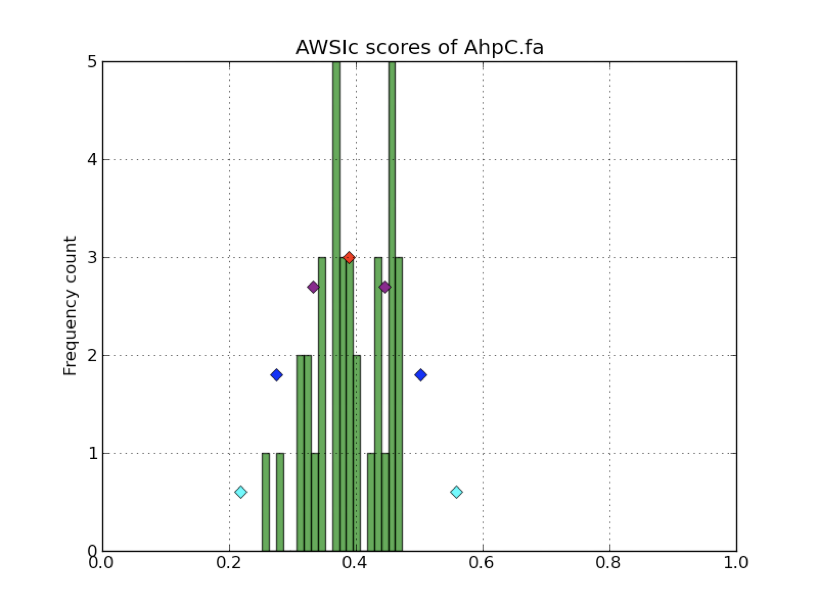

Building custom profiles
========================

Selenoprofiles can be used to search for any protein family.
Use the utility *selenoprofiles build* to create your own protein profile(s) from an aligned fasta file.
See its help page with::

  selenoprofiles build -h

Its basic usage is::
  
  selenoprofiles build -i input_alignment.fa -o built_profile.fa [options]
  
The filename determines the name of the profile.
After building a profile, you may use it with selenoprofiles providing it to the -p option, e.g.::

  selenoprofiles -o output_folder -t target_file.fa -p built_profile.fa

To build new profiles, the user should understand the basics of their functioning.
A profile consists of two types of information:

  1. a sequence alignment (compulsory)
  2. and a set of filtering criteria applied when searching with that profile (optional)

     
The sequence alignment
----------------------
A profile represents a protein family. A selenoprofiles search constitutes a search for sequences that *fit* in the profile.
A profile includes homologs from multiple species, ideally as diverse as possible.

**Important**: because exonerate and genewise may select any profile sequence for their prediction, it is important that you only
include *complete* sequences in the profile. Partial sequences may give rise to partial predictions.

The variation among profile sequences determines which homologs it can identify.
A profile is efficient in identifying homologs belonging to lineages that are included in the profile,
or anyhow whose diversity is recapitulated in the profile.
For example, a profile built with sequences from all metazoan lineages is suitable to search vertebrate genomes;
but a profile built with only vertebrate sequences employed to search insect genomes may be missing some homologs.

Where do you take the sequence alignments to build a new profile? There are two typical cases:

  - ready-made alignments of homologs are downloaded from protein family databases (e.g. PFAM,
    HOGENOM, NCBI protein clusters, and many others)

  - given a single starting protein, a collection of homologs are obtained from similarity searches at NCBI blast,
    then aligned (e.g. using Clustal Omega, T-Coffee or other alignment programs)

As rule of thumb, we recommend to have at least 10 sequences in your profile, and not more than 200.
If you have >200, *selenoprofiles build* offers the *-r* option to reduce their number::

  selenoprofiles build -i input_alignment.fa -o built_profile.fa -r 0.8

This removes sequences so that any pair of remaining sequences are not more similar than the threshold provided (above, it is 80%).

For more advanced alignment handling functionalities, we recommend the program Trimal.
Its options -clusters and -maxidentity are useful to reduce the number of sequences, by selecting representative that maximize diversity.

Note: it is good practice to visually inspect alignments to evaluate their quality. We recommend the program Jalview for this task.

Filtering criteria
------------------

The filtering procedures associated to a profile can be fully customized.
They are specified as chunks of python code in the *profile_name.fa.config* file.
If undefined, global defaults set in the *~/.selenoprofiles_config.txt* apply.
For example, this is the default blast_filtering::

  blast_filtering.DEFAULT = x.evalue < 1e-2 or x.sec_is_aligned()

In all filtering procedures, *x* refers to the prediction under consideration.
Thus, blast filtering retains blast hits with e-value smaller than 0.01.
(For selenoprotein families, it also keep all blast hits aligned to selenocysteine, regardless of e-value.)

The two other filtering steps occur consecutively at the end of the pipeline. Here's their default setting::

  p2g_filtering.DEFAULT   = len(x.protein()) >60 or x.coverage()> 0.4
  p2g_refiltering.DEFAULT = x.awsi_filter()

The first one, *p2g_filtering*, is employed to dismiss small predictions. It requires a minimal protein sequence length of 60,
or an horizontal span ("coverage") of 40% of the profile.

The second one, *p2g_refiltering*, is employed to check the fit of the candidate within the profile in terms of sequence similarity.
The default procedures is based on a metrics called AWSI and it is detailed in the next section.

Many built-in profiles implement non-default filtering, which was set after extensive heuristic testing to ensure good specificity.
You may check these by inspecting  ``~/selenoprofiles_data/selenoprotein_profiles/*.config`` files.
These may serve as "inspiration" and showcase of useful methods to explore to set up filters for challenging families.

Default filtering typically works for most families.
However, when setting up new profiles, it is important to test them, by searching "control"
genomes and comparing gene predictions with expectations:
does it find annotated homologous genes in model species? Does it report false positives?
If so, further below you have some tips to improve your profile.

AWSI filter
-----------

The principle used for prediction filtering is that the degree of sequence diversity in the profile determines the threshold
for filtering candidate homologs: profiles with highly similar sequences accept only very similar predictions;
while highly diverse profiles use a looser filtering.

In practice, we define a sequence similarity measure, and we compute it between every pair of sequence in the profile.
The distribution of similarities define the cut-off to evaluate how much new candidates fit the profile:
we compute their mean and standard deviation, and set the cut-off to ``mean - 3*std_dev``.
In other words, the inclusion threshold is z-score = -3.

The measure used in selenoprofiles is a variant of sequence identity called Weighted Sequence Identity (WSI).
WSI is computed for every profile sequence, as the average of its sequence identities with all other profile sequences,
applying different weights on the different alignment columns.
In any position, the weight is computed as the conservation (0.0 - 1.0) of the amino acid here in this column of
the profile alignment, so that more conserved columns are given more importance.

By averaging WSI through profile sequences we obtain a useful profile metrics: AWSIw (=Average WSI without coverage).
The metrics used by default in selenoprofiles is called AWSIc (=Average WSI with coverage), and it equivalent but
involves an additional weight per column: the non-gap coverage,
i.e. the proportion of non-gap characters in each alignment position.
In this way, the alignment regions present only in a small subset of sequences have less importance.

The mean and standard deviation of AWSIc and AWSIw are printed in the profile summary, e.g.::

  .------------------------------------------------- Profile: yqec -----------------------------------------------------.
  | n_seqs: 200 ; n_queries: 200 ; n_clusters: 1                                                                        |
  | average AWSIc: 0.567 +- 0.045  ;  average AWSIw: 0.577 +- 0.039                                                     |
  |---------------------------------------------------------------------------------------------------------------------|
  
This summary is displayed after *selenoprofiles build*, but also after the profile is loaded in memory in a selenoprofiles search.

These values are computed for each prediction candidate.
In the native p2g format (:download:`see an example here<files/example.p2g>`), they are reported in the header.
The default procedure applied as last filtering step is to keep only sequences whose AWSIc is >= -3 z-scores.
So for the profile *yqec* above, the AWSIc cut-off is 0.567 - 3*0.045 = 0.432.

This is invoked by the call to the ``awsi_filter()`` method in the p2g_refiltering step::

  p2g_refiltering.DEFAULT = x.awsi_filter()

You may override this for any profile in its .config file. For example, this sets a more strict AWSIc z-score threshold::

  p2g_refiltering =  x.awsi_filter(z_score = -2)

The following explicitly defines a AWSIc threshold value, in this case more permissive::

  p2g_refiltering =  x.awsi_filter(awsi = 0.3)

The ``awsi_filter()`` method accepts the keyword *with_coverage*. Sets this to False (as shown below) to use AWSIw instead of AWSIc.
This is convenient for profiles with sequences of very variable length, e.g. due to the presence of "optional" domains::

  p2g_refiltering =  x.awsi_filter(z_score = -2.5, with_coverage=False)

*Selenoprofiles build* allows to print AWSIc values (option *-D*) or show their distribution with
an interactive pylab plot (option *-d*), such as the one shown below:

A practical guide to profile building
-------------------------------------

The best way to build good profiles is to progressively tune them by inspecting results.
All modifications are to be performed in the *profile_name.config* file.
Then, re-run the same selenoprofiles command line as before, but
delete files in the *output_folder/species_name.target_file_name/output/* folder and ad *-F* to force the execution of the filtering step.

If you plan to search a large number of genomes, it is a good routine to begin with just a few of them to get the profile right.
Redirect the stdout of selenoprofiles to log files, and inspect them. 

The first thing on the checklist is the number of processed blast hits.
If there are thousands, you should tighten up the blast filtering procedure, e.g. selecting a stricter e-value threshold with::

  blast_filtering = x.evalue < 1e-5

Then, genes in output should be inspected, to see if they fit your expectations. 
You can parse log files for OK tags, indicating an output gene, or DROPPED tags,  denoting predictions discarded by p2g filtering or refiltering.
Look out also for WARNING or ERROR tags to see if everything went fine.

If the expected genes are missing, set filtering to all-pass::

  p2g_filtering = True
  p2g_refiltering = True

If the expected genes are still missing, try adding more sequences to your profile, rebuild, and re-run the search from scratch (in a new output folder).

On the other hand, if you have too many output predictions, you may play around with ``awsi_filter()`` parameters as outlined in the previous section.

Sometimes, global sequence similarity metrics are not enough to discriminate true and false positives, and checking other features becomes compelling.
You may interrogate, for example, the (horizontal profile) coverage: the prediction is mapped into the profile,
and the coverage is computed as the distance between its projected boundaries, divided by the profile alignment length.
A strict coverage filter excludes partial protein predictions::

  p2g_refiltering = x.coverage()>0.75

When you are searching for protein families containing of common domains, you may want to exclude hits limited to these protein regions,
using the positions of the prediction mapped to the profile::

  p2g_refiltering = x.awsi_filter(awsi=0.15) and (not x.is_contained_in_profile_range(1, 60) and not x.is_contained_in_profile_range(100, 160))

The above setting defines a rather permissive AWSI-based filter, but explicitly excludes predictions that only aligned to alignment positions 1-60 and 100-160.

 
