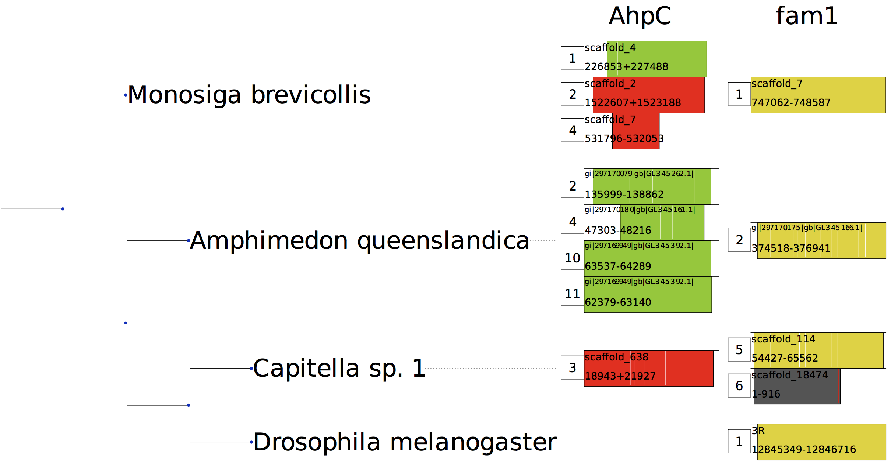
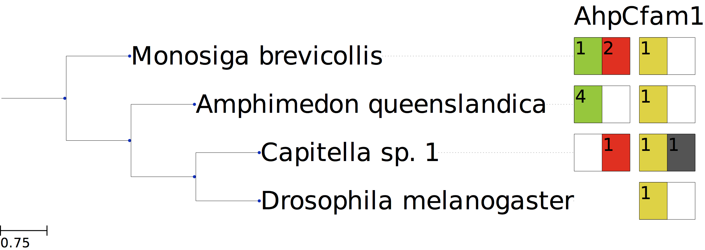

Selenoprofiles tools
==========================

Selenoprofiles was designed for comparative studies across multiples species.

If you search multiple targets (e.g. different species), you may use the same output folder (as long as target and species names are different).
As seen above, a subfolder within the output folder is created for each.

Collect results: selenoprofiles join
++++++++++++++++++++++++++++++++++++

To collect results from runs on multiple targets, you can use the *selenoprofiles join* utility. See its usage with::

  selenoprofiles join -h

As mentioned, each run of selenoprofiles produces one *ali* file for each profile with at least one result.
The *selenoprofiles join* utility collects *ali* files resulting from searching different targets, and
outputs a single *joined*  *ali* file per profile.

**Prediction identifiers** are augmented in *joined*  *ali* files to discriminate among targets.
They take this form:   *profile_name.index.label.species_name.target_file_name*

Display an overview of results: selenoprofiles drawer
+++++++++++++++++++++++++++++++++++++++++++++++++++++
  
The *selenoprofiles drawer* utility takes these *joined*  *ali* files and displays a graphical summary of results. ::

  selenoprofiles drawer -h

*Selenoprofiles drawer* also takes as input the tree of the species searched in newick format. Therefore, it shows the presence of
homologs of the protein families that were searched across the phylogenetic tree of those species.

To obtain (rough) species trees including virtually all known organisms, you may use NCBI taxonomy.
This can be done directly at its portal at http://www.ncbi.nlm.nih.gov/Taxonomy/CommonTree/wwwcmt.cgi,
or with more automated tools such as https://github.com/didacs/ncbi_taxonomy.

Here is an example of the output of *selenoprofiles drawer*:

Each result is shown as a colored rectangle. A numeric tag at its left indicates its selenoprofiles numeric index.
Each column corresponds to a different profile.

The rectangle width and position indicate the prediction coverage and horizontal span when mapped in the profile alignment.
Inside each rectangle you have the chromosome (or contig) name, and the genomic coordinate boundaries,
separated with "+" for results on the plus strand, and "-" for results on the minus strand.

Finally, the intron positions as relative to the protein alignment are shown as vertical white lines.
When frameshifts are present, they are shown as vertical red lines

**Color** is used to depict the **label** of results, e.g. "selenocysteine" results are green, "cysteine" are red,
"homologue" are yellow, "pseudo" are grey. To see a list of colors, run::

  selenoprofiles drawer -colors
	   
*Selenoprofiles drawer* becomes more concise with option *-a*, as it shows only the count of results for each label:
	   

Classify results: selenoprofiles orthology
++++++++++++++++++++++++++++++++++++++++++

The *selenoprofiles orthology* utility is designed to classify results from the *joined ali* files. This classification 
is based on orthologous groups, providing insights into the organization of selenoprotein families. See its usage with::

  selenoprofiles orthology -h

As output, it produces one tsv file per input file, classifying the subfamily of each selenoprofiles prediction.

Output columns:
 * **\Candidate**   sequence ID in selenoprofiles format (family.numericID.label.species.target_name)
 * **\Subfamily**   subfamily assigned to this sequence
 * **\Similarity**  similarity score between this sequence and the built-in "anchor" subfamily sequences
The output of selenoprofiles orthology can be used as input of selenoprofiles evolution (run: selenoprofiles evolution -h)

To classify any candidate sequence, we created a series of reference alignments for each multimember family containing
up to 10 sequences per subfamily. For subfamily assignment, candidate sequences are then aligned to reference alignments 
and classified according to the similarity score with every subfamily. The similarity score quantifies how much target 
sequences “fit” in a certain (sub)alignment. Each candidate is assigned to the subfamily with the highest similarity score.

For families with only a single member, the sequence similarity score is assessed against the overall family profile. 
This ensures a comprehensive and accurate classification, even for families with a more straightforward structure.

Here's a minimal command line::

  selenoprofiles orthology -i fam1.ali [fam2.ali ... famN.ali]  [other options]

These are the compulsory arguments:

 * **\-i**  input alignment file from selenoprofiles join utility.

Optional arguments::
 * **\-of** output folder, will be created if non-existing.
 * **\-o**  suffix of the output file. Default: .orthology.
 * **\-g**  how to take into account gaps when comparing sequences. Possible values: {y,n,t,a} Default: n
 * **\-m**  which similarity score metrics is used. Possible values: {i, w} Default: w
 * **\-w**  if AWSI is computed (-m w), define weights per alignment column. Possible values: {m, i, q} Default: m

For meaning of values, see https://pyaln.readthedocs.io/en/latest/alignment.html#pyaln.Alignment.score_similarity

Filtering results: selenoprofiles lineage
+++++++++++++++++++++++++++++++++++++++++

The *selenoprofiles lineage* utility is designed to exclude non-expected genes predicted by Selenoprofiles. This filtering 
is based on expectations of the various vertebrate lineages from Mariotti et al [1]. See its usage with ::

  selenoprofiles lineage -h

This utility takes the .tsv files produced by selenoprofiles orthology as input. As output, it produces one tsv file per
input file, filtering non-expected predictions.

Output columns:
 * **\Candidate**            sequence ID in selenoprofiles format (family.numericID.label.species.target_name)
 * **\Subfamily**            subfamily assigned to this sequence
 * **\Similarity**           similarity score between this sequence and the built-in "anchor" subfamily sequences
 * **\Species**              species name of the predicted sequence
 * **\Pass_filter**          boolean column indicating if the sequence is expected or not
 * **\Discard_description**  column that provides an explanation for why the filter criteria were not met

Here's a minimal command line::

  selenoprofiles lineage -i fam1.orthology.tsv [fam2.orthology.tsv ... famN.orthology.tsv]  [other options]

These are the compulsory arguments:
 * **\-i**  selenoprotein family fam.orthology.tsv file(s) produced by selenoprofiles orthology (run: selenoprofiles orthology -h)

Optional arguments:
 * **\-of**   output folder. Default: current directory.
 * **\-o**    suffix of the output file. Default: .lineage.
 * **\-temp** temporal folder to save intermediate files.
 * **\-a**    optional output .ali file. Requires the input .ali file used in selenoprofiles orthology. Outputs an alignment of the filtered sequences.
 * **\-all**  decides whether to keep or not selenoprotein homologs
 * **\-exp**  provide own expectation table
 * **\-map**  map manually species to lineage. Avoids using NCBI_DB. User needs to provide a species /t lineage table.
 * **\-pexp** print the expectation table
 * **\-l**    include lineage in the output table
 
1. Mariotti, M. et al. Composition and Evolution of the Vertebrate and Mammalian Selenoproteomes. PLoS One 7, e33066 (2012).

Assessing annotations: selenoprofiles assess
++++++++++++++++++++++++++++++++++++++++++++

The *selenoprofiles assess* utility evaluates genome annotations using selenoprofiles predictions as bona fide selenoprotein annotation. 
See its usage with::

  selenoprofiles assess -h

This tool has three different inputs: selenoprofiles gtf file, genome gff file and genome fasta file. It produces two outputs: A tsv file with 
the annotation for each genome transcript and a tsv file with the annotation for each genome gene. 

Here's a minimal command line:

  selenoprofiles assess -s selenoprofiles.gtf -e genome.gtf -f genome.fa [other options]

These are the compulsory arguments:
 * **\-s**  selenoprofiles predictions in gtf or gff format
 * **\-e**  genome annotations in gff or gff3 format
 * **\-f**  genome fasta file

Optional arguments:

 * **\-o**    Specify the name of the output tsv table containing annotation for each genome transcript.
 * **\-agg**  Specify the name of the output tsv aggregate table containing annotation for each gene.
 * **\-cs**   Specify the name of selenoprofiles column which will be taken as ID to work with. Default is transcript_id.
 * **\-cg**   Specify the name of input genome's column which will be taken as ID to work with. Default is ID.
 * **\-stop** Specify if stop codons are removed and how. Three options available: 'auto', 'all' and 'no'. Default is 'auto'.

      - **'auto'** In case some genome transcripts have stop codons and some not. Searches for transcripts with stop codons and removes them.
      - **'all'** The last three positions from each genome transcript are removed, without performing any search.
      - **'no'** Assumes there are no stop codons in genome transcripts, so they aren't removed.

