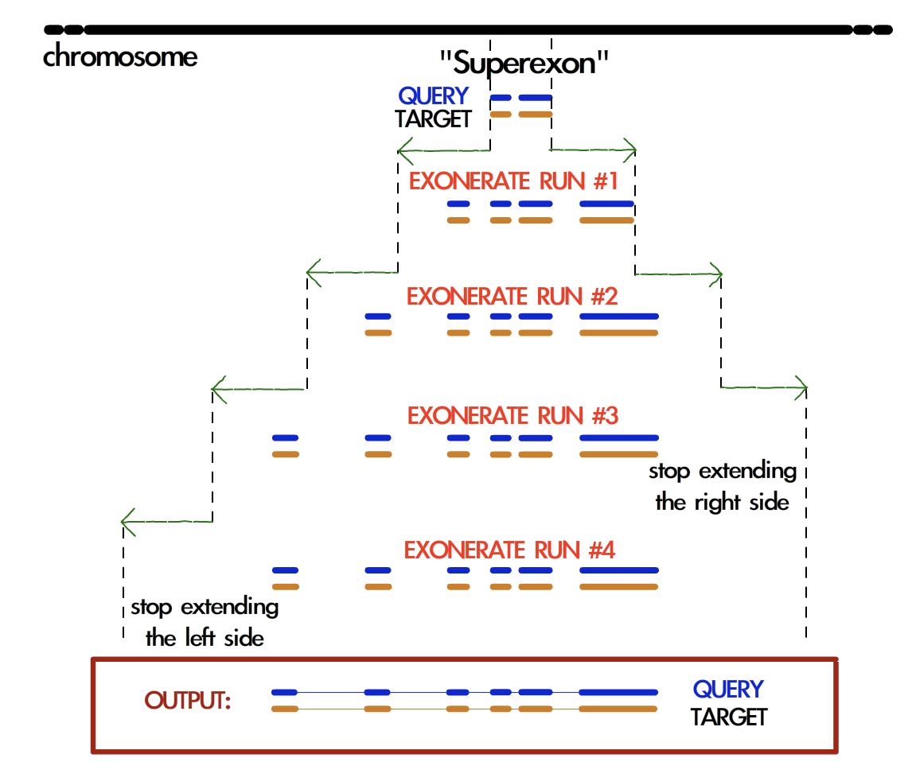

Workflow and folder structure
=============================

In summary, the pipeline is structured as follows (see also figure below).

The program **psitblastn** is used with a PSSM derived from the profile alignment to identify matches in the target genome.
These matches are then used, through the two splice alignment programs **exonerate** and **genewise**,
to deduce the exonic structure of the candidate genes.

The predictions of these three programs
are analyzed and the best prediction is **chosen**. Then, it is then **labelled** through a dedicated procedure.
The predictions are also sometimes **improved** by a few procedures, e.g. they are completed at the 3' looking for a stop codon
and the 5' looking for a methionine codon.

In the workflow, there are three **filtering** steps. First, the blast filtering, which controls how many gene candidates will be processed.
Then the p2g filtering and p2g refiltering, both of which are at the end of the pipeline.
All filtering steps are user definable for each profile.
We provide a sensible default filtering for user input families: each alignment is examined and, based on its sequence conservation,
a similarity threshold is chosen (AWSI filter). This means that a very conserved profile outputs only very similar sequences.

A third filter is applied when multiple profiles are searched, and there are overlapping matches across profiles.
These are assigned to the highest scoring family, and the others are dismissed.

A graphical summary:

.. figure:: images/workflow.png

Selenoprofiles normally performs the full pipeline, taking care of
skipping the steps executed previously. The steps of selenoprofiles are:
blast, exonerate, genewise, prediction choice, prediction filtering,
database storage, output. These are denoted respectively by the
step-options *-B -E -G -C -F -D -O* (see figure).

After the filtering step, results are stored in a SQLite **database**.
When selenoprofiles is run, it checks first if the results database contain already the 
results requested, and in that case it passes directly to the output step.

If the
user specify any step-option, the execution of the corresponding step
and of all next ones is forced. This is necessary if you changed
parameters or profile specific procedures. If for example you changed
some parameter relative to the filtering phase, you must force filtering
and output with *-F*.

**Important:** when output is forced,
selenoprofiles  overwrites previous output files, but **it will never delete any**.
This may lead to overlapping predictions in the output.
If you re-run selenoprofiles adding profiles to the search, we recommend to delete all output files first. 

.. warning::

   In the selenoprofiles paper, the program SECISearch was included in the workflow,
   but it is not anymore. To run its successor SECISearch3, visit the webserver at https://seblastian.crg.es/.
   We recommend to produce *-out_three_prime* output with selenoprofiles to get
   the region downstream of predictions. Collect the *.three_prime* files
   corresponding to "selenocysteine" labels, upload them to the webserver, and select
   "SECIS prediction" only. 
   

Structure of selenoprofiles folder
----------------------------------

The output folder contains all files produced by selenoprofiles. A single folder can store the output data for multiple targets.
For each one, a subfolder for target is created concatenating with a dot the species and target names (e.g. Homo_sapiens.genome).
The output folder is designed for projects that may include searching multiple profiles in several species, or also in several targets for the same species (for example, genome and transcriptome).

The content of each target subfolder will vary depending not only on the results of the search, but also on the options specified by the user. 
In its most complete form, it contains the file:

 * **results.sqlite**             it is a database storing all filtered results on this target

and the folders:

 * **output**	      contains the final output files of selenoprofiles
 * **blast**	      contains the psitblastn output files
 * **exonerate** 	      contains the exonerate output files
 * **genewise** 	      contains the genewise output files
 * **prediction_choice**  contains the output files for the prediction choice/labelling step
 * **filtering**	      contains the output files for the filtering step
 * **tag_blast**	      contains the output files of the tag blast, if used (see tag blast)

Inside these folders, files are named with a prefix for the profile name.
Exonerate and genewise each produce a file for each blast hit satisfying the filtering conditions.
Here, the file names are composed adding to the profile name a index linked to a blast hit (example: fam.1.exonerate).
These files are actually contained in subfolders of the exonerate folder named as each profile.

In the output folder, files names contain also the label assigned to each result, followed by the file format (example: fam.1.selenocysteine.gff).

Example:
let's see files produced through this command line::

  selenoprofiles -o results_folder -t some_path/macaque/genome.fa -s "Macaca mulatta" -p SelM

::
  
  results_folder/Macaca_mulatta.genome/results.sqlite
  results_folder/Macaca_mulatta.genome/link_target.fa
  results_folder/Macaca_mulatta.genome/blast/SelM/SelM.psitblastn.1
  results_folder/Macaca_mulatta.genome/exonerate/SelM/SelM.1.exonerate
  results_folder/Macaca_mulatta.genome/genewise/SelM/SelM.1.genewise
  results_folder/Macaca_mulatta.genome/prediction_choice/SelM.tab
  results_folder/Macaca_mulatta.genome/filtering/SelM.tab
  results_folder/Macaca_mulatta.genome/output/SelM.ali
  results_folder/Macaca_mulatta.genome/output/SelM.1.selenocysteine.p2g

If you plan to run selenoprofiles massively, you may want to delete the intermediate files that it produces to avoid an excessive use of disk space.
All subfolders listed above can be deleted; as long as results have already been stored in the results.sqlite database,
selenoprofiles will be able to retrieve the desired predictions and produce output files.

When run with option -clean, selenoprofiles will delete all such subfolders (apart from output/) at the end of the computation. 

Full description of the pipeline
--------------------------------

The following detailed description is only meant for advanced users.

Psitblastn
----------

Selenoprofiles uses psitblastn from the NCBI blastall package. This
program can be considered an extension of tblastn. Instead of using only
a single sequence as query, it considers also a Position Specific
Scoring Matrix (PSSM). This allows to utilize the relative proportions
of allowed residues at each profile position. Normally, its more famous
relative psiblast (extension of blastp) is used iteratively against a
sequence database, building a PSSM with the matches it finds. In our use
of psitblastn, no iteration at all is performed, since the profile
alignment is already provided as input and the PSSM can readily be
derived.

Pre-clustering
++++++++++++++

We experienced that when a profile is very broad (i.e., contains
sequences quite dissimilar to each other), the psitblastn search is not
very sensitive. For this reason, selenoprofiles implements a procedure
that analyzes the input profile alignment in terms of its variability,
and clusters its sequences based on their sequence identity. If the
profile has a high variability, then this procedure will produce more
than one cluster.

Then, a psitblastn search for each cluster is performed: one PSSM is
built from the sequences of each cluster. Consequently, often there are
overlapping blast hits coming from the searches of different clusters.
Those are merged, keeping only the best one for each overlapping set.
The sequence identity threshold for the profile clustering procedure can
be defined for each profile (*clustering_seqid* parameter), or goes to
the default value defined in the main configuration file.

Consensus blast query
+++++++++++++++++++++

Psitblastn build a PSSM along the positions of a certain sequence of the
profile, elected as the blast query. In our experience, the choice of
the blast query has a big effect on the results of the search. The blast
query is built for each search, as a “consensus”. Its sequence is given
by the most present amino acid at each position of the alignment (or of
the cluster, if more than one is present). There are two exceptions to
this. For selenoproteins, in the positions where at least a Sec is
detected, the blast query always bears a U. Then, the positions
featuring a lot of gaps in the alignment are skipped. The maximum
percentage of gaps for a column depends on the option
*max_column_gaps_for_blast_query*, either specified in the profile
configuration or set to the default in the main configuration file.

For technical reasons, all blast hits loaded in selenoprofiles are
transformed so that their alignments are between the target and a unique
query sequence, named the master blast query. This allows to have a more
homogenous kind of data for subsequent computation: otherwise, blast
hits coming from different clusters searches would have different
sequences as query.

Merging exons by co-linearity
+++++++++++++++++++++++++++++

After the overlapping hits from the various cluster searches are
removed, blast hits are once again analyzed, and those likely to be
exons of the same gene are joined: they are merged by co-linearity. This
means that if a blast hit is downstream of another one, and also the
correspondent portions of the aligned query sequences are one downstream
of the other in the same direction, the blast hits will be merged into a
single object (if they are not too far away). This procedure is done to
minimize redundant computation.

Blast filtering
+++++++++++++++

Blast hits are filtered according to criteria that may be specified for
each profile. In our experience, different protein families need very
distinct criteria. Some families typically match a lot of spurious hits,
while some others need loose filters to find all results. All filtering
procedures in selenoprofiles are written in python and can be customized
by the user, utilizing a set of methods that are already provided or can
be created by the user. Filtering is detailed in a later.
Blast filtering is performed actually before removing
redundancy across cluster searches, and also before merging by
co-linearity. This is because merging blast hits requires loading them
all into memory, sorting them and parsing them -- which sometimes would
take very long if all blast hits in a output file are considered.

If for some reason you want to inspect manually the blast hits passing
the filter, you can use option -*filtered_blast_file* and provide a file
as argument, which will be created. Blast hits within this file have not
been subject to inter-cluster or co-linearity merging.

Maximum number of blast hits
++++++++++++++++++++++++++++

In selenoprofiles, the computation is largely dependent on the number of
blast hits passing filtering. For this reason, there is a fixed maximum
number of blast hits which can be considered. The default value is
extremely loose: 2500. When the limit is passed for a family, a warning
is printed on screen and the workflow follows keeping only the blast
hits found so far. Blast hits are read in the order they are in the
blast output file. Blast sorts the hits according to the chromosomes (or
contigs) they are located on, ordering the chromosomes according to the
e-value of the best HSP found on them. This way of sorting is not
strictly best-to-worse but it is similar, therefore most likely you
won’t lose any bona-fide gene because you reached the maximum limit of
blast hits.

Also, the blast outputs produced searching the different clusters are
read in order, with the cluster containing the highest number of
sequences being first. Therefore, the first blast output read should be
the most representative.

In an older version of selenoprofiles, the computation would simply stop
if the max number of blast hits is reached. This behavior can be
restored by setting off the relevant option, with
*-blast_filtering_warning 0.*

Exonerate
---------

Each alignment coming from the blast phase is used as a seed to run
exonerate in the corresponding genomic region, using a proper extension
procedure.

Reading and joining exonerate predictions
+++++++++++++++++++++++++++++++++++++++++

Exonerate is run on a chromosomic region in which a blast hit was found,
and typically it will give a single gene structure prediction in output.
Nonetheless, this is not always the case. For this reason,
selenoprofiles considers only the exonerate prediction which, among
those in its output file, overlaps with the blast hit used as seed. If
more than one overlapping prediction is present (very rarely), the best
scoring one is taken.

Also, exonerate generally joins the exons belonging the same gene,
including the prediction of splice sites. Nonetheless, often no good
scoring splice sites are found and such predictions may be found
separated. Selenoprofiles attempts to merge the “main” exonerate
prediction with the others in the same file, using the co-linearity
concept previously mentioned for blast hits. This behavior is turned off
when selenoprofiles option *no_splice* is active.

Cyclic exonerate
++++++++++++++++

Exonerate is run through a peculiar routine called cyclic exonerate (see
figure below; see also selenoprofiles paper). This procedure comes in
response to the following problem: if we want to run exonerate on a
certain genomic region where a blast alignment gave us the hint of an
homology match, we need to decide the boundaries of the region searched
by exonerate. Of course the region provided by blast needs to be
extended, but by how much? Gene sizes are incredibly variable. Taking
the biggest size ever observed would result in a huge amount of useless
computation, while on the other side taking an average would obviously
be inappropriate for a fraction of cases.

This routine solves this problem by running exonerate more than once,
increasing progressively the genomic space searched on both sides by a
fixed parameter. The cycle stops when a run predicts the same coding
sequence of the previous one. If the extension parameter is chosen
greater than the largest expect intron, the procedure ensures that the
widest prediction possible is achieved.

The cyclic routine runs exonerate on average less than 3 times. Given
the high speed of exonerate, this is more than acceptable timewise, also
considering that this step is not the most computationally intensive in
selenoprofiles. Also, if the chromosome (contig) is comparable in size
to the extension parameter, the cyclic routine is not performed and the
whole chromosome is used as target. The default *exonerate_extension* is
200.000 bases.

		    
*Schema of the cyclic exonerate routine, from the selenoprofiles 2010 paper.
A “superexon” represents either a
blast hit, or more than one merged by co-linearity.*

Choosing the best query from the profile
++++++++++++++++++++++++++++++++++++++++

Exonerate accepts a single sequence query, but in the pipeline the
information of a whole profile of sequences is available. Thus,
selenoprofiles chooses the best query sequence in the profile for each
candidate gene, by searching the query which is most similar to the
sequence predicted in the target. To do so, the current predicted
sequence is mapped to the profile alignment exploiting the query, which
is in common between the prediction alignment and the profile alignment.
This is done at every cycle, before running exonerate. At the first run,
the predicted sequence in the target is given by the blast prediction,
and for each subsequent run is given by the previous exonerate
prediction. Before closing the cyclic routine, it is checked that the
best query is still the one that was lastly chosen, otherwise one more
cycle is run.

Modifying exonerate behavior for selenocysteine sites
+++++++++++++++++++++++++++++++++++++++++++++++++++++

Selenoprofiles was created to predict genes belonging to selenoprotein
families. It is able to do so by using special scoring schemes with
exonerate and genewise (blast is used with a neutral score at these
sites).

When dealing with Sec families, a particular scoring matrix derived from
BLOSUM62 is used: the alignment of a “\*” character to a stop codon in
the target is scored positively. When the query is chosen from the
alignment, its sequence is modified before it is used by exonerate: all
the positions which contains at least one Sec in the profile are changed
to “\*”, favoring *de facto* the alignment of Sec positions to UGA
codons.

Removing redundant exonerate hits
+++++++++++++++++++++++++++++++++

Often, blast hits representing exons of the same genes pass through the
co-linearity merge procedure previously described, mainly because this
is kept with loose parameters to avoid joining accidentally similar,
close genes. When this happens, such blast hits are used to seed cyclic
exonerate runs which end up in identical gene structure predictions.

After all exonerate runs are computed, their predictions are analyzed
and the redundant ones are dropped, to save computational time in the
genewise phase.

Genewise
--------

Generally, genewise represents the most computationally expensive step
in selenoprofiles, together with blast. Genewise performs a tblastn-like
alignment complemented with prediction of splice sites, basically just
like exonerate, which. Nonetheless, genewise does not use heuristics and
its running time is considerably higher. When you need to maximize
speed, you can skip the genewise step using option
-*dont_genewise*.

Genewise is generally run on genomic regions defined by an exonerate
prediction, attempting to refine them. Such genomic regions are extended
by a parameter, *genewise_extension*, which is only 100 bases by
default. Unlike exonerate, genewise is run only once.

Genewise “to be sure” routine
+++++++++++++++++++++++++++++

In many cases exonerate does not produce any prediction in output. This
happens particularly for very low scoring blast hits, which cannot be
reproduced by exonerate. In these cases, selenoprofiles performs a
genewise routine called “to be sure”, in which a blast hit (instead of
an exonerate prediction) is used as seed of a genewise run. In our
experience this rescues many predictions, but it is very computationally
expensive. The extension of genomic region in the blast hit is defined
by the *genewise_tbs_extension* parameter, which is 10.000 bases by
default. One can avoid running this routine using option
*-genewise_to_be_sure 0*.

The query in genewise
+++++++++++++++++++++

As for exonerate, a single query sequence needs to be chosen to be run
with genewise. In a standard run, the same query used by exonerate is
chosen, as this is already the most similar to the target sequence. When
a blast hit is used in the genewise “to be sure” routine, the best
sequence is chosen from the profile by maximizing identity with the
target, in the same way it is done in the first cycle of an exonerate
routine.

Modifying genewise behavior for selenocysteine sites
++++++++++++++++++++++++++++++++++++++++++++++++++++

For genewise, a trick similar to the one described for exonerate is used
when searching for selenoprotein families. Each query used is modified
to bear a selenocysteine (“U”) corresponding to every column of the
alignment which possesses at least one. Then, the translation table
normally used by genewise is changed, using one in which UGA is
translated as “U”. The scoring matrix given to genewise is then a
modified BLOSUM62, in which a “U” in the target is score positively only
to a “U” in the query.

Improving predictions
---------------------

In selenoprofiles a few steps are dedicated to the processing of the
predicted gene structures, in order to correct them. All of them are
implemented as methods of the superclass *p2ghit*, which comprises the
classes for blast, exonerate or genewise predictions (see p2ghit
class in Advanced usage). These methods are run through "Actions"
(also explained in Advanced usage) specified in the main configuration file. You can turn
off the improvements methods by removing, or commenting (with #), the
corresponding lines in the main configuration file.

The first improvement is called *remove_internal_introns* and is
performed only on blast hits. This method is useful because often blast
joins two or more coding exons in a single hit, when the exons are on
the same frame and the resulting stretch of unaligned amino acids in the
target is acceptable in terms of scoring. A typical blast hit containing
an evident intron is shown here::

   Score =  100 bits (249), Expect = 4e-20
   Identities = 49/93 (52%), Positives = 59/93 (63%), Gaps = 26/93 (27%)
   Frame = +2

   Query: 12     LEPYMDENFITRAFAKMGENPVSVKLIRNKMTG--------------------------E 45
                 LEPYMDENFI+RAFA MGE  +SVK+IRN++TG                           
   Sbjct: 103916 LEPYMDENFISRAFATMGELVLSVKIIRNRLTGYV*SLFVFYHIPNFGVHLHTLFSLSRI 104095

   Query: 46     PAGYCFVEFADEASAERAMHKLNGKPIPGANPP 78
                 PAGYCFVEFAD A+AE+ +HK+NGKP+PGA P 
   Sbjct: 104096 PAGYCFVEFADLATAEKCLHKINGKPLPGATPV 104194

The portion ``YV*SLFVFYHIPNFGVHLHTLFSLSRI`` is the translation of an intron.
It has no correspondence in the query, and it also contains a stop codon
(it is normal as introns have no coding constraint). The
*remove_internal_introns* method detects these cases by searching the
sequence in the target for stretches of at least 18 bp (6 amino acids)
not aligned to the query, and removes them from the prediction.

The second improvement is performed by function
*clean_inframe_stop_codons*. This is applied to predictions by all
programs, and comes from the observation that often these programs
include stop codons that should be avoided. This would cause these
predictions to be mislabelled as pseudogenes. This method is simple in
principle: it checks for the presence of stop codons close to exon
boundaries (default maximum: 10 codons). If it finds any, it removes the
stop codons and also the portion which links it to the closest exon
boundary.

The third improvement is *exclude_large_introns*. This is particularly
useful on exonerate predictions, which sometimes possess extremely large
introns, due only to spurious similarity with far away regions, and to
the presence of decent splice sites just by random. This function
detects each such large intron (default >= 140000 nt), and removes all
exons (typically just one) at one side of that intron, the side with the
smallest coding sequence.

While all described methods are applied before prediction choice, the
fourth and fifth improvements are performed at the end of pipeline, only
on the predictions passing the filter; nonetheless, they are described
here below.

The functions *complete_at_five_prime* and *complete_at_three_prime* are
attempts to complete the coding sequence predictions looking for an
upstream ATG and a downstream stop codons. Let’s see the corresponding
lines in the *selenoprofiles.config* file::

  ACTION.post_filtering._improve4= if x.filtered=='kept': x.complete_at_three_prime(max_extension=10, max_query_unaligned=30)

  ACTION.post_filtering._improve5= if x.filtered=='kept': x.complete_at_five_prime(max_extension=15, max_query_unaligned=30, full=False)

The completion at 5’ is performed only if a ATG is found before a stop
codon, and if at most 15 codons would be added. Also, two other
conditions must be met: no non-standard characters must be find in the
5’ extension, and the profile query of this prediction must have an
unaligned portion at N-terminal not bigger than 30 amino acids. This is
to avoid completing partial hits, whose upstream ATG are not likely to
be the real starts, as other large portion of coding sequence are
expected upstream.

Also, normally the function stops when the first methionine is found
upstream -- if the first codon is already a AUG, no extension is
performed. When *full=True* is provided, it attempts instead to extend
to the furthest possible methionine, when coupled with high values of
*max_extension*.

The completion at the 3’ is performed only if the profile query has an
unaligned portion at C-terminal not bigger than 30 amino acids, if the
extension is at most 10 codons, and if no strange characters are found
in the candidate extension.

The use of these two methods is very limited by default, because
selenoprofiles is meant to kept its nature of homology-based tool.
However, their extent can easily be altered by the user through the main
configuration file, as shown earlier in “searching RNA sequences or
bacterial genomes”.

Selenoprofiles can be customized to perform additional improvements. The
user has to write a function accepting a *p2ghit* as input, and modify
the main configuration file to run the function at the right step, using
actions.

Prediction program choice
-------------------------

After the genewise step, three predictions are available for every
candidate: one by blast, one by exonerate, and one by genewise. The
predictions are analyzed and only one is taken to represent this
candidate gene to the filtering phase, and possibly to output. The
function *choose_prediction* is used to decide among any number of
candidates. This same function is used during all steps in which genes
are merged to remove redundancy, to decide which one to keep. The
following conditions are checked in order: if at any point only one of
the predictions shows to be better than all others for a criteria, the
function stops and that prediction is returned.

The first condition checked is the presence of frameshifts. If a
prediction possesses frameshifts while another doesn’t, the latter is
taken.

Then, if the predictions come from a selenoprotein family, the number of
aligned Sec positions is considered: if one possess more than the
others, it is chosen.

The number of in-frame stop codons (others than SecTGAs) is then
checked: if one possess less than the others (for example one has none,
while the others have), it is chosen.

After, the length of the predicted coding sequence is determinant: the
prediction featuring the longest sequence is chosen.

If at this point the choice has not been made yet, the prediction whose
program has highest priority is chosen, given these priorities in
descending order: genewise, exonerate, blast.

Option *-no_blast* forces selenoprofiles to choose the exonerate or
genewise prediction. This is useful only if an accurate splice sites
prediction is important for you. It comes at the cost that, when only
the blast prediction is available (for example because exonerate
produced an empty output, and genewise an invalid alignment), the
candidate is always discarded.

Labeling
--------

After a single prediction per candidate is chosen, this is analyzed and
labelled.

For standard families, there are only two possible labels: *homologue*
(a regular prediction) and *pseudo* (with any in-frame stop codon or
frameshift). It is possible for the user to define its own labeling
procedure: this is shortly described later ("option -add").

For selenoprotein families, labeling is used to characterize the amino
acid aligned to the Sec position. Generally there’s a single Sec in
selenoproteins. If there’s more than one, the label assigned by
selenoprofiles depends on the most-left aligned Sec position. The
possible labels are *selenocysteine*, *cysteine* or any other amino acid
(only rarely found at these positions though). If the prediction does
not span any Sec position, it is labelled as *unaligned*. If it contains
frameshifts or in-frame stop codons (apart from Sec-TGA), then it is
labeled as *pseudo*. An additional label, *uga_containing*, is assigned
to those predictions whose only pseudogene feature is one or more in
frame UGAs (of course not aligned to Sec positions). This label is
useful because very rarely the scoring schemes used for selenoprotein
families allow the alignment over a non-Sec UGA, and we don’t want to
filter those out as if it were pseudos. Also, the label may be useful to
discover new Sec positions in known selenoprotein families.

Final filtering
---------------

After labeling, predictions are evaluated through the final filter
before output. This filter, exactly as the blast filter, can be specific
for each family and be written using the methods provided in
selenoprofiles classes. The filter outcome is summed up in a filtering
label, hereafter called “filtering state” (or just state) to
differentiate it from the label assigned in the previous step. The final
filter actually consists of two separate filters, called *p2g_filtering*
and *p2g_refiltering* in the configuration files. A prediction excluded
by the first one will be assigned a state of *filtered*. A prediction
excluded by the second one will be assigned a state of *refiltered.*

Just before the predictions enter the final filter, there is an
additional redundancy check: the predictions overlapping each other are
compared and only the best one is kept. Predictions discarded this way
are assigned a state of *redundant*.

Those predictions which passed all the redundancy check and the two
steps of the final filter without being discarded are assigned a state
of *kept* and represent the normal output of selenoprofiles.

Nonetheless, the user may decide to output the predictions with a
different state, using the *-state* option, optionally with multiple
arguments, comma separated with no space within. If for example you want
to output all *filtered* and *refiltered* predicted, add to your command
line::

  -state filtered,refiltered

The *-state* option can accept the following arguments: *kept*,
*filtered*, *refiltered*, *redundant* or *overlapping* (see below).
There is a way to have even more control on what prediction are output:
the *-output_filter* option. This accepts a procedure with the same
syntax of filters and actions, which is evaluated for every prediction:
those for which this evaluates to *True* will be output. If for example
you want to output only predictions on the positive strand, you can use::

  -output_filter "x.strand==‘+'"

To do this, you need to know a bit about the classes used in
selenoprofiles, described in the Advanced usage section. After
filtering, results are stored in the sqlite database, ready for the
output phase (below).

Removing inter-family redundancy
--------------------------------

Selenoprofiles scans for multiple profiles in a single run. The output
is produced only when all families have been searched. This is because
results from different profiles may overlap, especially when some of
them share a certain degree of sequence similarity. So after all results
are stored in the database, this is parsed and every prediction is
compared with all others on the same chromosome (or contig). When two
such predictions overlap, the function
*choose_among_overlapping_p2gs_interfamily* is used to decide which one
to keep. The other is assigned a state of *overlapping.* These
predictions will not be output by default. Note that this operation is
performed directly on the database: the intermediate text files written
in the filtering phase will display the state previously assigned.

Another important note: the inter-family redundancy check is performed
every time an output phase is run, and depends on the results present in
the database at that moment. For this reason, searching several profiles
in distinct selenoprofiles runs will lead to more (or the same number
of) output files than searching all of them in a single run. The results
database at the end will be identical, but as when every profile reached
its output phase, the predictions of all other profiles were not
available, the inter-family redundancy cannot be checked properly.

If you searched different profiles on separates runs, the best thing to
do is just delete all output files and rerun selenoprofiles with all
these profiles using *-D* flag to re-run database storage. No heavy
computation will be repeated, and only the output files for the
non-overlapping predictions will be produced.

