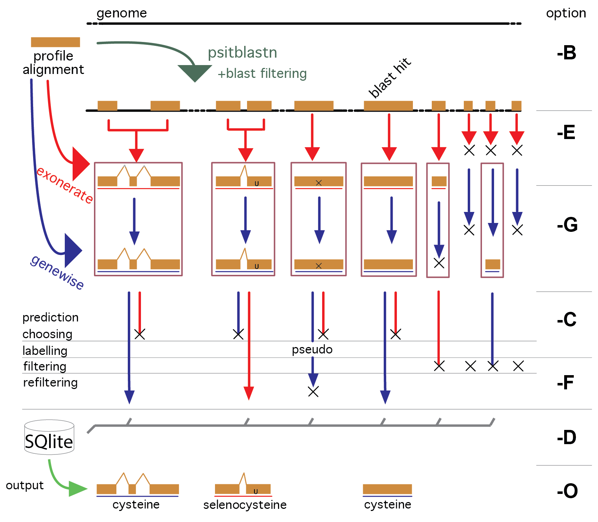

Workflow and folder structure
=============================

In summary, the pipeline is structured as follows (see also figure below).

The program **psitblastn** is used with a PSSM derived from the profile alignment to identify matches in the target genome.
These matches are then used, through the two splice alignment programs **exonerate** and **genewise**,
to deduce the exonic structure of the candidate genes.

The predictions of these three programs
are analyzed and the best prediction is **chosen**. Then, it is then **labelled** through a dedicated procedure.
The predictions are also sometimes **improved** by a few procedures, e.g. they are completed at the 3' looking for a stop codon
and the 5' looking for a methionine codon.

In the workflow, there are three **filtering** steps. First, the blast filtering, which controls how many gene candidates will be processed.
Then the p2g filtering and p2g refiltering, both of which are at the end of the pipeline.
All filtering steps are user definable for each profile.
We provide a sensible default filtering for user input families: each alignment is examined and, based on its sequence conservation,
a similarity threshold is chosen (AWSI filter). This means that a very conserved profile outputs only very similar sequences.

A third filter is applied when multiple profiles are searched, and there are overlapping matches across profiles.
These are assigned to the highest scoring family, and the others are dismissed.

A graphical summary:

Selenoprofiles normally performs the full pipeline, taking care of
skipping the steps executed previously. The steps of selenoprofiles are:
blast, exonerate, genewise, prediction choice, prediction filtering,
database storage, output. These are denoted respectively by the
step-options *-B -E -G -C -F -D -O* (see figure).

After the filtering step, results are stored in a SQLite **database**.
When selenoprofiles is run, it checks first if the results database contain already the 
results requested, and in that case it passes directly to the output step.

If the
user specify any step-option, the execution of the corresponding step
and of all next ones is forced. This is necessary if you changed
parameters or profile specific procedures. If for example you changed
some parameter relative to the filtering phase, you must force filtering
and output with *-F*.

**Important:** when output is forced,
selenoprofiles  overwrites previous output files, but **it will never delete any**.
This may lead to overlapping predictions in the output.
If you re-run selenoprofiles adding profiles to the search, we recommend to delete all output files first. 

.. warning::

   In the selenoprofiles paper, the program SECISearch was included in the workflow,
   but it is not anymore. To run its successor SECISearch3, visit the webserver at https://seblastian.crg.es/.
   We recommend to produce *-out_three_prime* output with selenoprofiles to get
   the region downstream of predictions. Collect the *.three_prime* files
   corresponding to "selenocysteine" labels, upload them to the webserver, and select
   "SECIS prediction" only. 
   

Structure of selenoprofiles folder
----------------------------------

The output folder contains all files produced by selenoprofiles. A single folder can store the output data for multiple targets.
For each one, a subfolder for target is created concatenating with a dot the species and target names (e.g. Homo_sapiens.genome).
The output folder is designed for projects that may include searching multiple profiles in several species, or also in several targets for the same species (for example, genome and transcriptome).

The content of each target subfolder will vary depending not only on the results of the search, but also on the options specified by the user. 
In its most complete form, it contains the file:

 * **results.sqlite**             it is a database storing all filtered results on this target

and the folders:

 * **output**	      contains the final output files of selenoprofiles
 * **blast**	      contains the psitblastn output files
 * **exonerate** 	      contains the exonerate output files
 * **genewise** 	      contains the genewise output files
 * **prediction_choice**  contains the output files for the prediction choice/labelling step
 * **filtering**	      contains the output files for the filtering step
 * **tag_blast**	      contains the output files of the tag blast, if used (see tag blast)

Inside these folders, files are named with a prefix for the profile name.
Exonerate and genewise each produce a file for each blast hit satisfying the filtering conditions.
Here, the file names are composed adding to the profile name a index linked to a blast hit (example: fam.1.exonerate).
These files are actually contained in subfolders of the exonerate folder named as each profile.

In the output folder, files names contain also the label assigned to each result, followed by the file format (example: fam.1.selenocysteine.gff).

Example:
let's see files produced through this command line::

  selenoprofiles -o results_folder -t some_path/macaque/genome.fa -s "Macaca mulatta" -p SelM

::
  
  results_folder/Macaca_mulatta.genome/results.sqlite
  results_folder/Macaca_mulatta.genome/link_target.fa
  results_folder/Macaca_mulatta.genome/blast/SelM/SelM.psitblastn.1
  results_folder/Macaca_mulatta.genome/exonerate/SelM/SelM.1.exonerate
  results_folder/Macaca_mulatta.genome/genewise/SelM/SelM.1.genewise
  results_folder/Macaca_mulatta.genome/prediction_choice/SelM.tab
  results_folder/Macaca_mulatta.genome/filtering/SelM.tab
  results_folder/Macaca_mulatta.genome/output/SelM.ali
  results_folder/Macaca_mulatta.genome/output/SelM.1.selenocysteine.p2g

If you plan to run selenoprofiles massively, you may want to delete the intermediate files that it produces to avoid an excessive use of disk space.
All subfolders listed above can be deleted; as long as results have already been stored in the results.sqlite database,
selenoprofiles will be able to retrieve the desired predictions and produce output files.

When run with option *-clean*, selenoprofiles will delete all such subfolders (apart from output/) at the end of the computation. 

The description provided in this page should be sufficient for most users. The next page
offers a more detailed explanation of all operations in the pipeline, suited for advanced usage.

